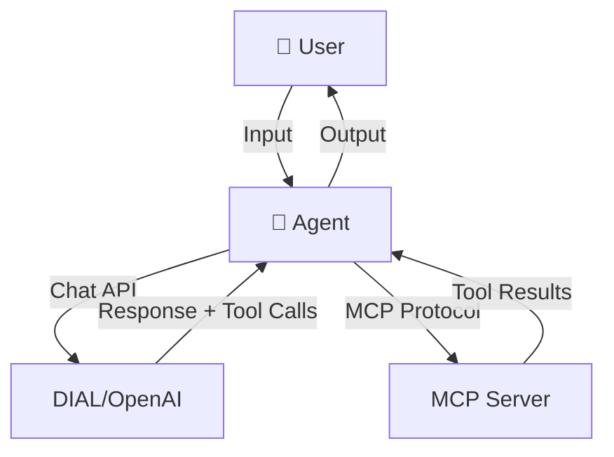
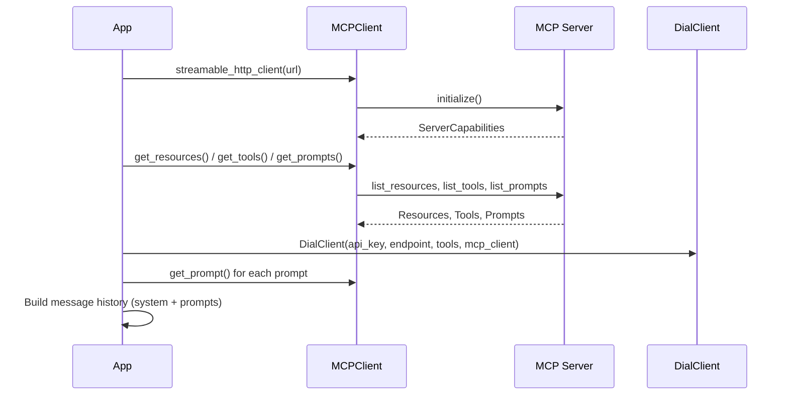
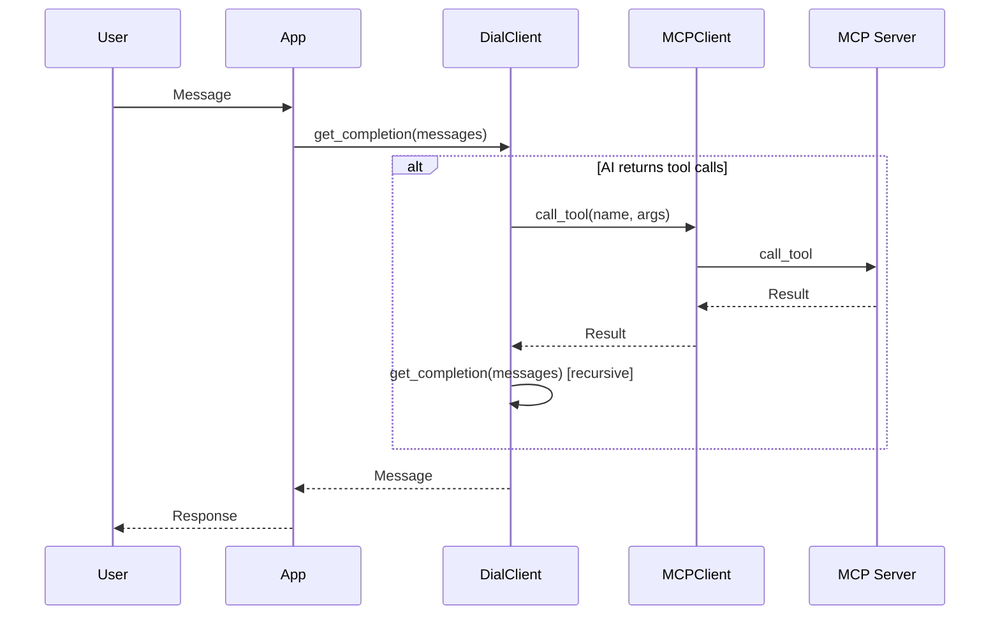

# Architecture

## System Overview

**Agent** (`agent/`): Console app that orchestrates DIAL and MCP.  
**MCP Server** (`mcp_server/`): User management tools, flow diagram resource, and guidance prompts.

---

## Initialization Flow

---

## Chat Loop (with Tool Calling)

---

## Components

| Component | Responsibility |
|-----------|----------------|
| **app.py** | Entry point, MCP setup, message history, chat loop |
| **MCPClient** | MCP connection via `streamable_http_client`, tools/resources/prompts |
| **DialClient** | DIAL/OpenAI chat, streaming, tool-call handling, delegates execution to MCPClient |
| **Message** | Chat message model (role, content, tool_calls, tool_call_id) |

---

## MCP Server Capabilities

| Type | Name | Description |
|------|------|--------------|
| **Tools** | get_user_by_id, search_user, add_user, update_user, delete_user | User CRUD and search |
| **Resource** | users-management://flow-diagram | Flow diagram (image/png) |
| **Prompts** | search_guidance, user_creation_guidance | Search and creation guidance |

---

## Tech Stack

- **Agent**: Python, asyncio
- **MCP**: `mcp` SDK, `streamable_http_client`
- **AI**: Azure OpenAI (`AsyncAzureOpenAI`)
- **MCP Server**: FastMCP, streamable HTTP transport
